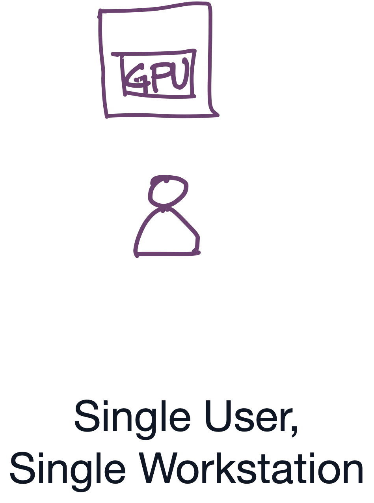
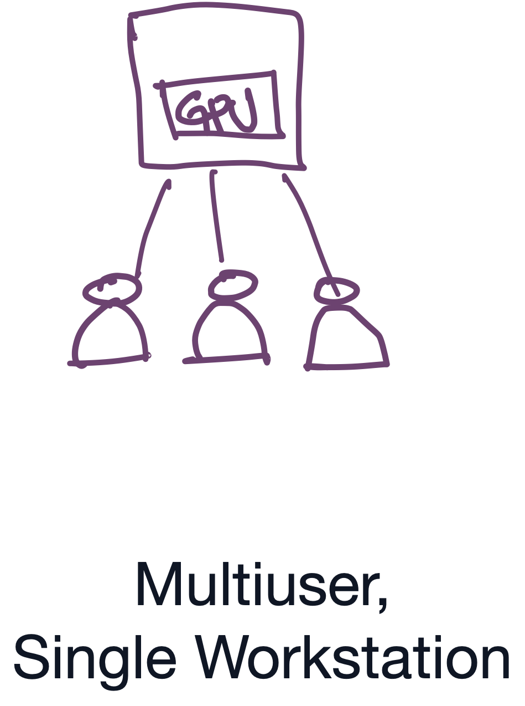
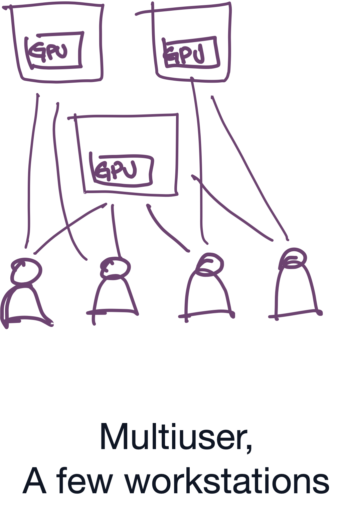
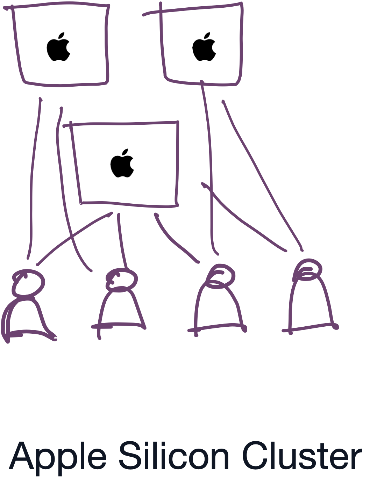
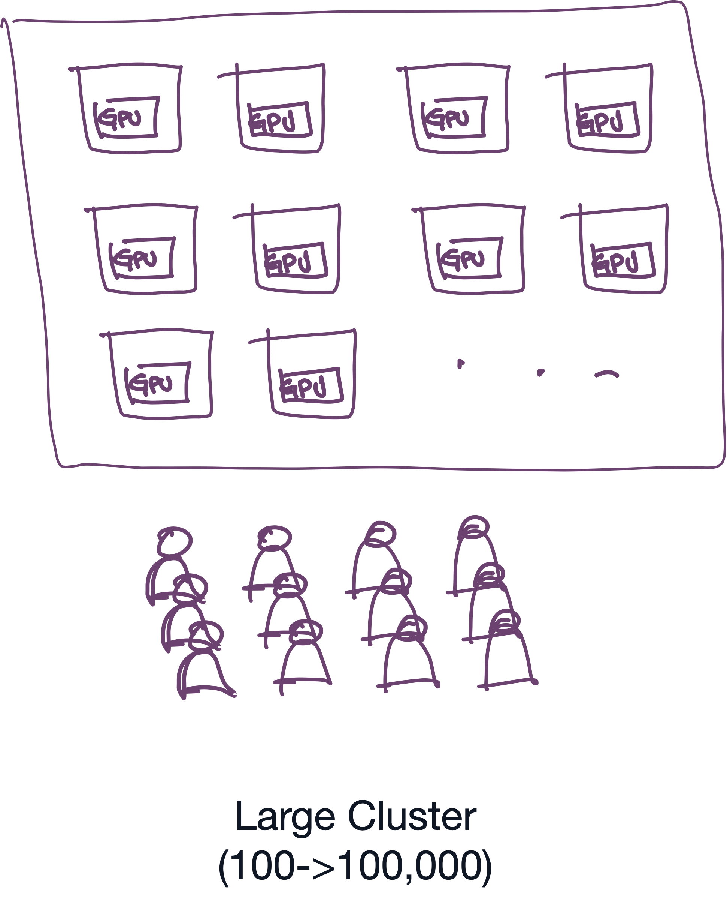
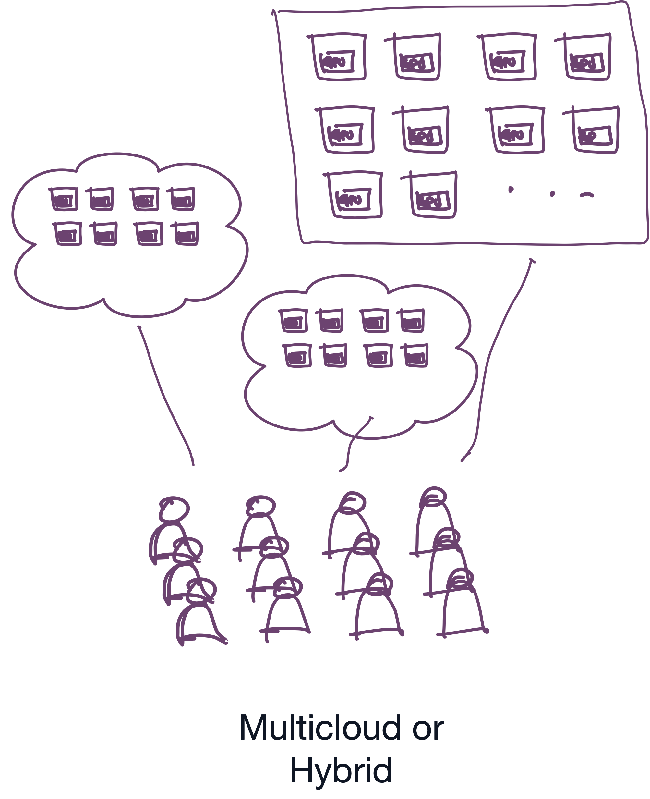

# The Definitive Guide to Building a Machine Learning Research Platform 🚀

This guide is for **academic institutions and research labs** ready to establish their first cohesive machine learning research platform. We've designed this guide for IT directors, principal investigators, and system architects tasked with building a unified environment where every researcher—from the first-year student to the seasoned postdoc—can train models efficiently. Whether you are starting with a single "under-the-desk" GPU server or scaling to a university-wide cluster, this guide provides the technical blueprints and strategic philosophy needed to turn raw hardware into a world-class discovery engine.

In this guide, we are not attempting to list every possibility but, rather, to offer the most common "tried and tested" configurations, with a bias toward modern, simple tooling that is open source and easy to maintain.

> **Note:** This is a "living book" written on GitHub. We are looking for contributions from industry and academic experts to make recommendations. Found a mistake? Open an **Issue** or submit a **Pull Request**.

## Table of Contents

### Background

- **Philosophy & Components**
    - [The Foundation – Defining the stack: Drivers, Orchestration, and Storage](chapters/01-foundation.md)

### Configurations

| Configuration | Documentation |
|---------------|---------------|
|  | **The Single User AI Workstation (1 Node, 1 User)** • [Overview and Recommendations](chapters/02-single-user-single-workstation.md) • Step-by-Step OS Installation: &nbsp;&nbsp;• [Setup Ubuntu 22.04 Server with CUDA Support for a Single User ML Workstation](chapters/02-02-01-ubuntu-cuda.md) &nbsp;&nbsp;• [Setup Ubuntu with AMD ROCm Support for a Single User ML Workstation](chapters/02-02-02-ubuntu-rocm-amd.md) &nbsp;&nbsp;• [Which Mac to Buy for Machine Learning](chapters/02-02-03-macos.md) |
|  | **The "Under-the-Desk" Server (1 Node, Multiuser)** • [Overview and Recommendations](chapters/03-under-the-desk.md) • [Step-by-Step Install Instructions](chapters/03-01-install.md) |
|  | **The "Closet Cluster" (2–5 Nodes)** • [Overview and Recommendations](chapters/04-closet-cluster.md) • [Option 1: Step-by-Step Install Instructions – Building a Small SkyPilot + k3s Cluster (recommended)](./chapters/04-02-skypilot-k3s-install.md) • [Option 2: Build a k3s Cluster using Skypilot + Rancher](./chapters/04-03-rancher-skypilot.md) • Option 3: Step-by-Step Install Instructions – Building a Small SLURM Cluster (coming soon) |
|  | **[The "Mac Silicon Cluster"](chapters/05-apple-silicon.md)** |
|  | **The "University Cluster" (10–100 Nodes)** • [Overview and Recommendations](chapters/07-university-cluster.md) • [Option 1: Step-by-Step Install Instructions – Building a Large Kubernetes Cluster with Rancher + Skypilot](./chapters/07-02-skypilot-rancher-install.md) • Option 2: Step-by-Step Install Instructions – Building a Large Slurm + Transformer Lab cluster |
|  | coming soon |
|  | coming soon |
| | **The Air-Gapped Systems** coming soon |