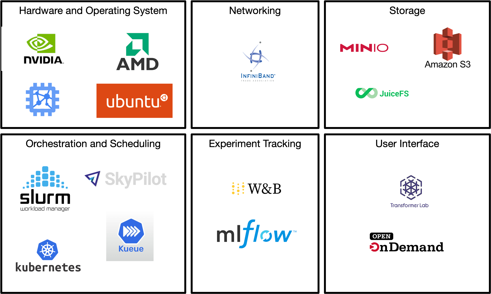

# Philosophy & Components

## Research vs. Production ML Clusters

Building a cluster for a **research team** is fundamentally different from building one for production deployment.

**Production clusters** prioritize **uptime and latency**. Their goal is to serve models 24/7 to end users, so redundancy and high availability are paramount.

**Research clusters**, conversely, prioritize **utilization, flexibility, and fairness**. In a research environment:
*   **The Goal:** Ensure expensive hardware isn't sitting idle and that researchers (e.g., PhD students or R&D scientists) get equitable access to compute time.
*   **The Workflow:** Workloads are often "bursty." A researcher might spend days coding (low compute) and then launch a massive distributed training job that consumes 100% of the cluster for 48 hours.
*   **The Architecture:** Unlike production inference, which needs high availability but low node-to-node communication, research workloads like large-scale distributed training demand high bandwidth between nodes (for gradient synchronization).

## Growing a Research Cluster

Most labs evolve through a predictable cycle of hardware needs driven by the demand for faster training and larger datasets.

1.  **The Workstation (Single Node):**
    *   Most researchers start here. A single machine, perhaps a laptop or a dedicated tower with 1-4 GPUs.
    *   *Resource Management:* At this stage, management is often manual. If multiple users share the machine, they might use hacks like `CUDA_VISIBLE_DEVICES` in their SSH terminals or `.bashrc` files to mask specific GPUs from each other (e.g., User A takes GPU 0, User B takes GPU 1). This quickly gets hard to manage.
2.  **The Centralized Server:**
    *   As the team grows, manual coordination becomes unwieldy ("Is anyone using GPU 2 right now?"). You upgrade to a centralized server with higher density (e.g., 8x GPUs) to provide shared compute to the organization.
    *   *The Bottleneck:* Without a scheduler, users stepping on each other's processes leads to out-of-memory (OOM) errors and zombie processes.
3.  **The Cluster:**
    *   Eventually, a single node is insufficient. You scale to multiple servers connected by a network.
    *   *The Solution:* This necessitates a job scheduler (like Slurm or Kubernetes) to manage the queue, ensuring fair access and preventing collisions.

## Components to Consider

In this guide we focus on the following core components of a machine learning research cluster:

1) Hardware and OS
2) Networking
3) Storage
4) Orchestration and Scheduling
5) Experiment Tracking and Model/Data Registries
6) User Interface

### Hardware and OS

#### GPUs:

* **NVIDIA:** The research default; Blackwell (B200/GB200) architecture and the indispensable CUDA ecosystem.
* **AMD:** The MI300/MI325X series; significant growth for researchers using PyTorch/ROCm.
* **Apple Silicon:** M3/M4 Ultra; popular for local prototyping and "Small LLM" research via MLX.
* **TPUs/LPUs:** Google TPU v6 (Trillium) for massive scaling; Groq (LPU) for ultra-fast inference research.

#### Operating Systems:

* **Ubuntu:** The industry standard for driver compatibility and container support.
* **Rocky Linux / AlmaLinux:** Preferred in traditional HPC for RHEL-based stability.
* **Talos Linux:** A modern, security-focused "immutable" OS for Kubernetes-first clusters.

### Networking

* **InfiniBand (NVIDIA/Mellanox):** The gold standard for low-latency, lossless communication in large-scale distributed training.
* **Ethernet with RoCEv2:** A cost-effective alternative using standard switches (Broadcom, Arista) to achieve RDMA speeds.
* **Ultra Ethernet Consortium (UEC):** The 2026 open standard for scaling AI networking beyond InfiniBand's vendor lock-in.

### Storage

* **JuiceFS:** A distributed layer that provides a POSIX interface over cheap object storage (S3/MinIO).
* **MinIO:** High-performance, self-hosted S3-compatible object storage for managing massive datasets. (Note: MinIO development appears to have slowed; there are direct alternatives.)
* **S3/GCS/R2:** Object stores from AWS, Google Cloud Storage, and Cloudflare.
* **Pure Storage / NetApp:** Proprietary enterprise "Flash-first" arrays for labs requiring high reliability and turnkey management.
* **WEKA & VAST Data:** Proprietary AI-native parallel file systems designed to feed data to GPUs at wire speed.
* **Longhorn:** A lightweight, open-source distributed block storage system for Kubernetes that turns local node disks into highly available, replicated volumes for stateful workloads.

### Orchestration and Scheduling

* **Slurm:** The traditional HPC king; excellent for batch jobs and raw performance.
* **Kubernetes + Kueue:** The 2026 standard for "Cloud-Native" labs; brings modern queueing to K8s.
* **SkyPilot:** "Meta-scheduler" that abstracts the cluster, allowing jobs to run anywhere (Local vs. Cloud).
* **Dstack:** Alternative to SkyPilot that avoids the complexity of Kubernetes.

### Experiment Tracking and Model/Data Registries

* **Weights & Biases (W&B):** The premier choice for visualization and collaborative research.
* **Tensorboard:** Open-source metric tracking for ML.
* **MLflow:** A versatile open-source platform for tracking experiments and managing the model lifecycle.

### User Interface

* **Transformer Lab:** An open-source control plane that talks to Slurm or SkyPilot.
* **JupyterHub:** The standard web interface for multi-user notebook access.
* **Open OnDemand:** A powerful portal for high-performance clusters providing shell access, file management, and GUI apps.
* **VS Code Remote:** The preferred IDE for researchers to write code locally while executing on cluster GPUs via SSH.

## Example Configurations

In the rest of this guide we outline detailed recommendations for different labs of different sizes. Example stacks could look like:

| Component | **University Research Lab** | **The AI Startup** | **The Micro Lab / Indie** |
| --- | --- | --- | --- |
| **Compute** | NVIDIA H200/B200 (On-prem) | H100s (Cloud-burst / Lambda) | RTX 5090 / Mac Studio |
| **OS** | Rocky Linux / Ubuntu | Ubuntu or Talos Linux | Ubuntu Desktop / macOS |
| **Networking** | InfiniBand (NDR) | Ethernet + RoCEv2 (400G) | 10GbE / Tailscale |
| **Storage** | VAST Data / Lustre | JuiceFS + AWS S3 | Local NVMe + MinIO |
| **Orchestration** | Slurm | Transformer Lab + Kubernetes + Kueue | Transformer Lab + Kubernetes (k3s) |
| **Tracking** | W&B / MLflow | W&B (Team Edition) |  TensorBoard |
| **User Interface** | Open OnDemand / VS Code | JupyterHub / SkyPilot | VS Code Remote / SSH |

[**Return to the Home Page to Read about Specific Cluster Configuration Suggestions -->**](../README.md)