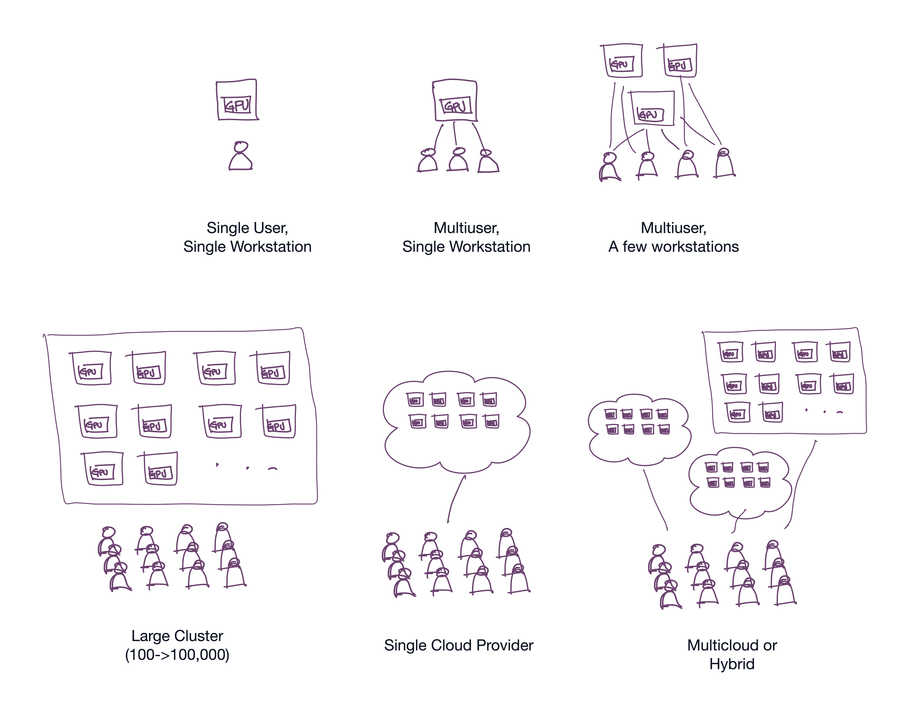
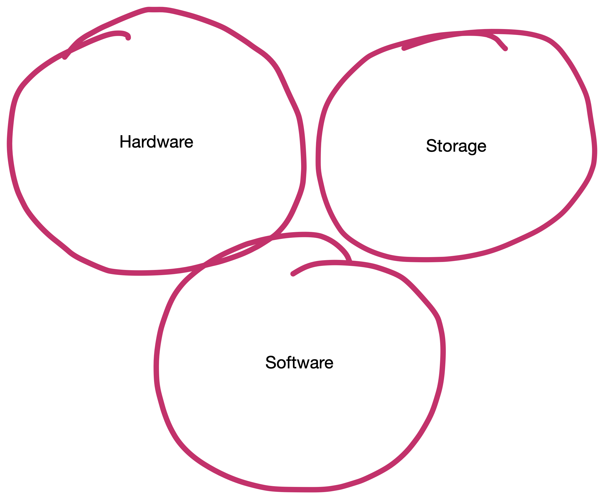
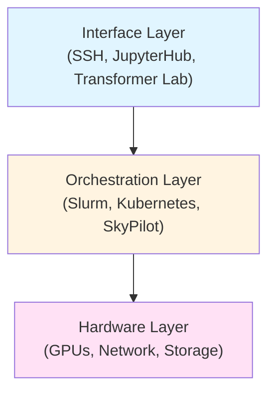

# Chapter 1: Philosophy & Components

## Research vs. Production ML Clusters

Building a cluster for a **research team** is fundamentally different from building one for production deployment.

**Production clusters** prioritize **uptime and latency**. Their goal is to serve models 24/7 to end-users, meaning redundancy and high availability are paramount,.

**Research clusters**, conversely, prioritize **utilization, flexibility, and fairness**. In a research environment:
*   **The Goal:** Ensure expensive hardware isn't sitting idle and that researchers (e.g., PhD students or R&D scientists) get equitable access to compute time.
*   **The Workflow:** Workloads are often "bursty." A researcher might spend days coding (low compute) and then launch a massive distributed training job that consumes 100% of the cluster for 48 hours.
*   **The Architecture:** Unlike production inference, which requires high availability but low node-to-node communication, research workloads like Large Scale Distributed Training require massive node-to-node bandwidth (gradients passing between GPUs).

## Growing a Research Cluster

Most labs evolve through a predictable cycle of hardware needs driven by the demand for faster training and larger datasets.

1.  **The Workstation (Single Node):**
    *   Most researchers start here. A single machine, perhaps a laptop or a dedicated tower with 1-4 GPUs.
    *   *Resource Management:* At this stage, management is often manual. If multiple users share the machine, they might use "hacks" like `CUDA_VISIBLE_DEVICES` in their SSH terminals or `.bashrc` files to mask specific GPUs from each other (e.g., User A takes GPU 0, User B takes GPU 1),. This quickly gets hard to manage.
2.  **The Centralized Server:**
    *   As the team grows, manual coordination becomes unwieldy ("Is anyone using GPU 2 right now?"). You upgrade to a centralized server with higher density (e.g., 8x GPUs) to provide shared compute to the organization.
    *   *The Bottleneck:* Without a scheduler, users stepping on each other's processes leads to out-of-memory (OOM) errors and "zombie processes".
3.  **The Cluster:**
    *   Eventually, a single node is insufficient. You scale to multiple servers connected by a network.
    *   *The Solution:* This necessitates a job scheduler (like Slurm or Kubernetes) to manage the queue, ensuring fair access and preventing collisions.

## Components To Consider

### Hardware
This is the physical foundation of your platform. For research, the network is often as critical as the GPUs themselves.

#### Compute Nodes
You will likely need a mix of node types:
*   **Training Nodes:** Dense, powerful servers (e.g., 8x high-end GPUs like H100s) designed for heavy lifting.
*   **Interactive Nodes:** Cheaper nodes with fewer GPUs intended for debugging, Jupyter Notebooks, and prototyping.

#### The Interconnect
If you plan to train large models across multiple nodes, standard Ethernet is insufficient. You need a high-speed fabric like **InfiniBand** or **RoCE** (RDMA over Converged Ethernet).
*   **East-West Traffic:** In distributed training, nodes pass gradients to each other continuously. Without a high-speed interconnect, nodes spend more time "chattering" than computing.
*   **Topology:** As you scale beyond a single switch (e.g., >36 ports), you must design a non-blocking network, typically a "Spine and Leaf" (Fat Tree) topology, to ensure consistent bandwidth.

### Unified Storage

All the compute in your cluster needs access to a common set of data and a place to store the outputs (artifacts) from jobs. Worker nodes are often ephemeral and can be in distributed clouds, but they all need to be able to see and write to the same data.

#### Hot Storage (High-Performance)
This is where active datasets often live. It must support massive throughput to keep GPUs fed.
*   **Technology:** Parallel file systems like **Lustre**, **WekaIO**, **GPFS**, or **BeeGFS** are standard. Cloud-native options include **JuiceFS** (a distributed POSIX file system built on object storage) and **Longhorn** (a Kubernetes-native distributed block storage system).
*   **Optimization:** Technologies like **GPU Direct Storage** allow GPUs to read directly from local NVMe drives, bypassing the CPU and system RAM to reduce latency.

#### Warm/Cold Storage (Object Store)
Cheaper storage for checkpoints, logs, and datasets not currently in use.
*   **Technology:** S3-compatible object storage (like **MinIO** for on-prem or AWS S3 for cloud).
*   **Artifacts:** A specific database is often needed to track model weights and training metadata, distinct from raw file storage.

### The Software Stack

The software stack transforms a collection of metal boxes into a usable research platform. It consists of three distinct layers, each serving a critical function.

## Three Layers

### Layer 1: Hardware Layer
This is the physical foundation consisting of:
*   **GPU Compute Nodes:** The actual servers containing GPUs (training nodes, interactive nodes, etc.)
*   **High-Speed Network Fabric:** InfiniBand or RoCE interconnects enabling node-to-node communication
*   **Parallel File Systems:** Lustre, BeeGFS, JuiceFS, or Longhorn providing high-throughput storage

### Layer 2: Orchestration Layer
This layer manages resource allocation, job scheduling, and policy enforcement. It decides which workload runs where and when.

*   **Slurm:** The HPC (High-Performance Computing) standard. Rock-solid for batch jobs with built-in fair-share and gang scheduling. Creates a queue system familiar to academic researchers.
*   **Kubernetes (K8s):** The cloud-native standard. Better for complex pipelines, serving, and web services, but requires additional tooling (like **Volcano** or **Kueue**) to handle batch scheduling and gang scheduling effectively.
*   **SkyPilot:** An abstraction layer that can sit on top of both Kubernetes and Slurm (as well as public clouds), offering a unified interface for defining jobs and managing "spot" instances for cost savings.

Key scheduling features include:
*   **Fair-Share Scheduling:** Adjusts priority based on historical usage to ensure equitable access
*   **Gang Scheduling:** Ensures "all-or-nothing" allocation for distributed jobs requiring multiple GPUs simultaneously

### Layer 3: Interface Layer
This is how researchers interact with the cluster. The choice of interface dramatically affects user experience and adoption.

*   **Bash Commands over SSH:** The traditional HPC approach. Users SSH into a login node and submit jobs directly using `sbatch` (Slurm) or `kubectl` (Kubernetes) commands. Requires deep technical knowledge but offers maximum flexibility and control.
*   **Interactive Development Environments:** Services like **JupyterHub** or **VS Code Server** provide web-based IDEs where researchers can develop and debug code interactively before submitting batch jobs.
*   **Unified GUI Platforms:** Tools like **Transformer Lab** provide a graphical interface that abstracts away the complexity of the underlying orchestrator. Users can launch jobs, manage experiments, access interactive sessions (Jupyter/VSCode), and track artifacts without mastering CLI commands or understanding Slurm/Kubernetes syntax.