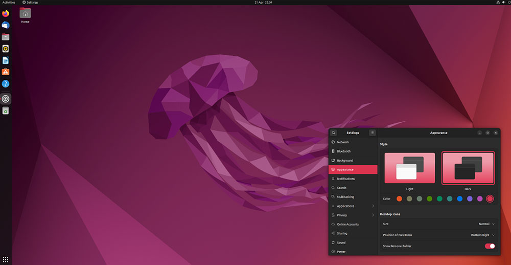
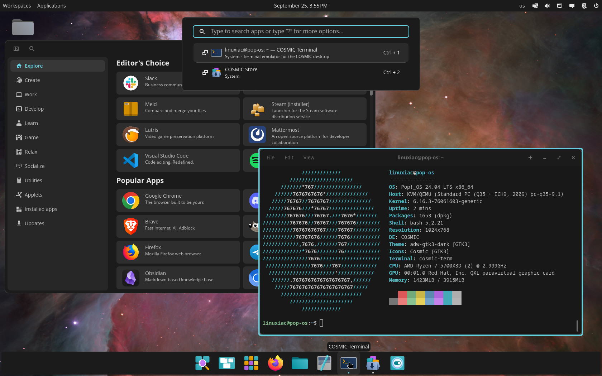

## Single User – Single Workstation ML Research Platform

For a single-user setup, keep your software stack simple and straightforward. Because you are the only user, you don't need complex virtualization or container orchestration layers. If a library conflict or driver error breaks your environment, you can clean and reinstall the components—or the entire OS. This straightforward approach works well for individuals working alone. However, once you need to share hardware with multiple researchers, you'll need the more complex configurations discussed in later sections of this guide.

---

### 1. Dedicated Linux Workstation

This is the gold standard for performance and software compatibility.

* **OS Recommendation:** [**Ubuntu 22.04 LTS:**](https://releases.ubuntu.com/jammy/) The industry standard for ML research. Most research repositories are developed and tested on Ubuntu, minimizing compatibility issues. This specific LTS version offers stable support across libraries and drivers.

* [**Pop!_OS:**](https://system76.com/pop/) A refined alternative that handles NVIDIA drivers and CUDA toolkit installation automatically, saving significant setup time.

* **The Advantage:** Native **CUDA support**. Since most deep learning libraries are optimized for NVIDIA hardware, this provides the smoothest path to running state-of-the-art models.

We have a guide to set up your single user workstation: [CUDA](./02-02-01-ubuntu-cuda.md) , [AMD](./02-02-02-ubuntu-rocm-amd.md)

### 2. Apple Silicon (MacBook Pro / Mac Studio)

Apple’s M-series chips are powerful options for researchers who need portability or high VRAM capacity without the bulk of a desktop.

* **The Framework:** macOS doesn't support CUDA. Instead, you use **MLX**, an array framework designed by Apple for machine learning on Apple silicon.
* **The Advantage:** **Unified Memory**. A Mac Studio with high RAM allows you to run or fine-tune large models (LLMs) that would normally require multiple enterprise-grade A100 GPUs.
* **The Trade-off:** MLX is powerful but still a niche ecosystem compared to CUDA. Some specialized CUDA kernels from research papers may require manual porting or adaptation.

[Here is a guide to purchasing and setting up a Mac for machine learning](./02-02-03-macos.md)

### 3. Cloud Services & Hosted Tools

While we often assume it is better to own hardware. Often when doing the  math on real utilization (and factoring in how quickly hardware becomes obsolete) -- it makes sense to rent GPUs in the cloud.

* **Providers:** Services like [**Runpod**](https://www.runpod.io/), [**Lambda Labs**](https://lambda.ai/), or [**Google Colab**](https://colab.research.google.com/).
* **The Economics:** Renting is often cheaper than buying. Including hardware depreciation, electricity, and the upfront cost of a $1,600+ GPU, renting an A100 or H100 only during training can be more cost-effective.
* **The Advantage:** Instant access to top-tier hardware and pre-configured environments without heat management or power supply concerns.

---

### Comparison Summary

| Platform | Primary Driver | Best For | Main Drawback |
| --- | --- | --- | --- |
| **Linux PC** | CUDA | General Research / SOTA | High upfront cost |
| **Mac Studio** | MLX | Portability / Large Inference | No CUDA support |
| **Cloud** | API / Web | Scaling / Cost-efficiency | Ongoing rental fees |
