# The "Closet Cluster" (2–5 Nodes)

**The Scenario:** You’ve outgrown your single workstation. Maybe you’ve acquired a few NVIDIA DGX Stations or built a handful of custom 4x GPU rigs. They are currently sitting in a ventilated closet or a small server room.

**The Challenge:** The "Wild West" era of SSH-ing into a random machine and running `nvidia-smi` to see if anyone is using it must end. If two researchers launch an LLM training job on the same node, both will crash with **OOM (Out of Memory)** errors, and the workday is lost.

### The Infrastructure Architecture

At this scale, your primary goal is to create a **Single System Image**—where researchers see a pool of GPUs rather than a list of IP addresses.

```mermaid
graph TD
    subgraph Users [Research Team]
        U1[Researcher A]
        U2[Researcher B]
    end

    subgraph Management [Control Plane]
        Head[Head Node / Controller]
        Storage[(Shared NFS Storage)]
    end

    subgraph Compute [The GPU Pool]
        N1[Node 1: 4x A100]
        N2[Node 2: 4x A100]
        N3[Node 3: 4x A100]
    end

    U1 & U2 --> Head
    Head --> N1 & N2 & N3
    N1 & N2 & N3 <--> Storage

```



---

## 1. Networking: The Tailscale Shortcut

Before diving into orchestrators and storage, you need to solve the fundamental problem: **How do your machines talk to each other, and how do researchers access them securely?**

At this scale, a great optoin is Tailscale

### Tailscale

**Tailscale** is a zero-configuration mesh VPN built on WireGuard. It creates a secure overlay network that makes all your machines appear on the same private network, regardless of their physical location.

**Why Tailscale is Perfect for Research Clusters:**

* **Zero Network Configuration:** No static IPs, no port forwarding, no firewall rules. Install the client, authenticate, and your machines instantly see each other.
* **Remote Access:** Researchers can SSH into cluster nodes from home as if they were on the lab network—without exposing SSH to the public internet.
* **ACL (Access Control Lists):** Define which users can access which machines. For example, `group:grad-students` can only SSH to interactive nodes, while `group:faculty` has full access.
* **MagicDNS:** Each machine gets a friendly hostname (e.g., `gpu-node-1.tail-scale.ts.net`). No more remembering IP addresses.
* **Subnet Routing:** If your cluster is behind a NAT or firewall, designate one node as a "subnet router" to give external researchers access to the entire private network range.

**Quick Setup:**

```bash
# On each node (Head + Workers)
curl -fsSL https://tailscale.com/install.sh | sh
sudo tailscale up
```

**Pro Tip for Research Labs:**
Enable **Tailscale SSH** to centralize SSH key management. Instead of distributing public keys to every machine, Tailscale handles authentication via your identity provider (Google, GitHub, Okta, etc.). When a researcher leaves the lab, revoke their Tailscale access—their SSH access disappears instantly across all machines.

---

## 2. The Crucial "Middle Layer": Storage

Before choosing an orchestrator, you must solve the two "closet killers":

* **The Shared Filesystem:** Researchers need their `/home` directory and datasets to be identical across all nodes.
* **The MVP Solution:** Set up a simple **NFS (Network File System)** on the Head Node. It’s easy to configure but will bottleneck if 5 nodes try to read a 100GB dataset simultaneously.


* **The Network Switch:** At 2–5 nodes, you can still use a single Top-of-Rack (ToR) switch. Ensure it is at least **10GbE** for data loading. If you intend to do multi-node training (Distributed Data Parallel), you will need **Mellanox/InfiniBand** or **100GbE RoCE**, or your scaling efficiency will tank.

---

## 3. Choosing Your Orchestrator

### Path A: The "Academic Gold Standard" (Slurm)

If your team comes from a university background, Slurm is the "correct" answer.

* **The Setup:** Designate the weakest machine (or a dedicated NUC) as the `slurmctld` (Controller). The GPU monsters run `slurmd` (Worker).
* **Best For:** Stability and strict "Fair Share" scheduling. It ensures Researcher A doesn't hog the cluster for three weeks straight.
* **The Catch:** You have to manage **MUNGE** keys for authentication and manually keep User IDs (UIDs) in sync across all machines.

### Path B: The "Cloud-Like" Abstraction (SkyPilot + SSH Backend)

SkyPilot provides a unified interface for launching jobs without managing orchestrator complexity directly.

* **The Setup:** Use SkyPilot's SSH backend. You provide SkyPilot with a list of IP addresses and SSH credentials for your nodes. No additional infrastructure required.
* **The Experience:** A researcher runs `sky launch task.yaml` from their laptop. SkyPilot finds an available machine, rsyncs the code, and starts the job. It handles resource allocation automatically.
* **Best For:** Teams that want simplicity and are comfortable with SSH-based access. Ideal if you want to avoid the overhead of running a full orchestrator but still need basic scheduling and resource management.
* **The Limitation:** No advanced scheduling features like fair-share or gang scheduling. Resource conflicts are handled at a basic level.

### Path C: The "Scalable Foundation" (SkyPilot + Kubernetes)

If you plan to scale beyond 5 nodes or need advanced scheduling, start with Kubernetes.

* **The Setup:** 
  * Don't install vanilla K8s—use **Rancher** (specifically **RKE2**). It's a production-grade distribution that simplifies installing the NVIDIA Device Plugin, GPU Operator, and other ML-specific components.
  * Install SkyPilot configured to use your Kubernetes cluster as the backend. This gives you the best of both worlds: K8s scheduling power with SkyPilot's simple interface.
* **The Experience:** 
  * Researchers still use `sky launch task.yaml` but now benefit from Kubernetes' advanced scheduling (via Volcano or Kueue).
  * Rancher provides a beautiful Web UI to monitor GPU utilization, logs, and pod health.
* **Best For:** Teams planning to grow beyond 10 nodes or that need persistent services (like a private Hugging Face mirror, MLflow server, or custom APIs) alongside batch training jobs.
* **The Investment:** Requires more initial setup time but pays dividends as you scale. Rancher significantly reduces the K8s complexity.

---

## 4. The User Interface: Transformer Lab

Regardless of the backend (Slurm, SkyPilot+SSH, or SkyPilot+K8s), your researchers shouldn't have to write complex `sbatch` scripts or YAML files daily.

**Transformer Lab** acts as the "Control Tower":

1. **Connect:** Point it at your Slurm Head Node, SkyPilot configuration, or K8s cluster.
2. **Submit:** Researchers use the GUI to select a model (e.g., Llama 3) and a dataset.
3. **Monitor:** Logs are streamed back to the UI, and artifacts (model weights) are automatically saved to your shared storage.

---

## The "Closet Cluster" Checklist

> [!IMPORTANT]
> * [ ] **Power:** Have you checked the circuit breaker? A single 8x GPU node can pull 3kW. Five nodes will melt a standard residential/office circuit.
> * [ ] **Cooling:** A closet with no airflow will reach 100°F (38°C) in minutes. You need at least 1 ton of dedicated cooling for every two high-end GPU nodes.
> * [ ] **UID Consistency:** Ensure User is ID `1001` on every single machine, or your shared storage permissions will become a nightmare.