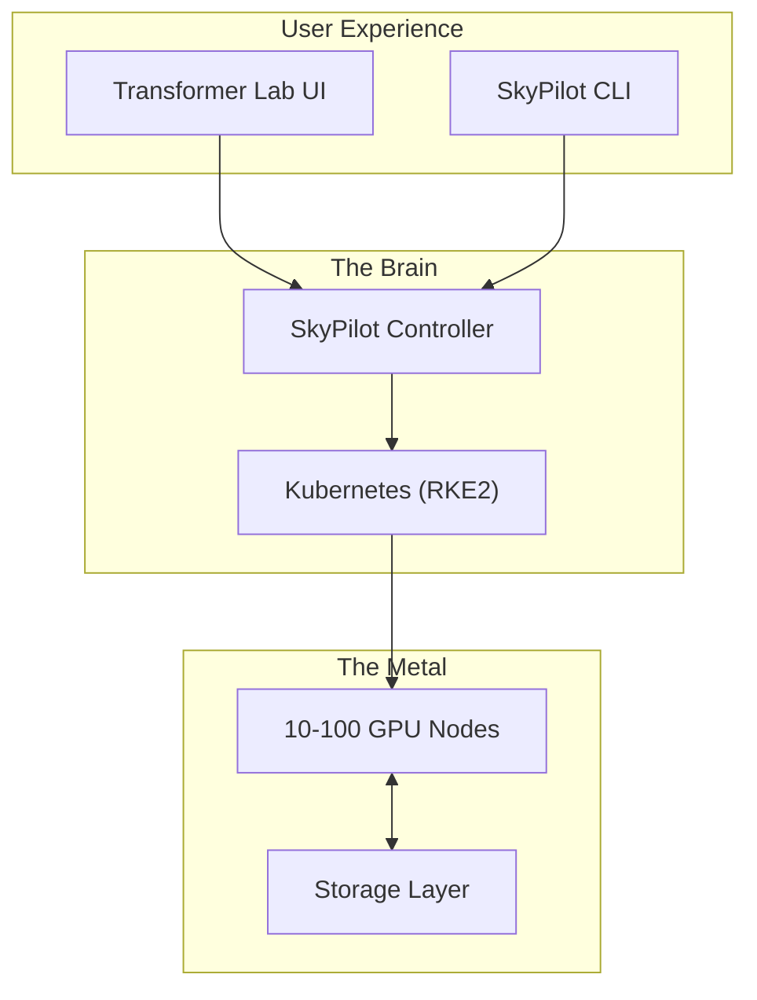

# Chapter 5: The "University Cluster" (10–100 Nodes)

**The Scenario:** You have graduated from the "Closet." You now have a dedicated server room or a caged row in a colocation facility. You have 10 to 100 compute nodes—likely a mix of dense training nodes (e.g., 8x H100s) and lighter inference/dev nodes.

**The Assumption:** We assume your hardware is racked, power is balanced, and your 100GbE or InfiniBand fabric is lit up. This chapter focuses entirely on the **Software Control Plane** required to tame this beast.

---

## 1. The Strategy: Modern vs. Traditional

At this scale, you have two divergent paths.

### Path A: The Traditional HPC Route (Slurm)

This is what most actual universities use. It is rock-solid and works well with MPI. However, it lacks modern container orchestration, making it difficult to host persistent services (like vector databases or inference endpoints) alongside batch jobs.

### Path B: The "Cloud-Native" Route (Kubernetes + SkyPilot)

**This is our recommended architecture.** By layering SkyPilot on top of Kubernetes, you get the best of both worlds:

1. **Ops Team:** Gets industry-standard management (Kubernetes) to handle health checks, networking, and storage.
2. **Researchers:** Get a simple, cloud-like interface (SkyPilot) that abstracts away the complexity of pods, services, and ingresses.

---

## 2. The Recommended Stack

We will provide a step-by-step installation guide in the **Appendices**, but here is the high-level architecture for a production-grade 100-node cluster.

### Step 1: The Base Layer (Rancher & RKE2)

Do not install vanilla Kubernetes with `kubeadm` unless you enjoy pain.

* **Recommendation:** Use **Rancher** to manage the cluster and **RKE2** (Rancher Kubernetes Engine 2) as the distribution.
* **Why:** RKE2 is secure by default and simplifies the installation of the **NVIDIA GPU Operator**, which automates the nightmare of keeping drivers and container runtimes in sync across 100 nodes.

### Step 2: The Entry Point (SkyPilot + Transformer Lab)

Kubernetes manifests (`.yaml` files) are too complex for most researchers.

* **SkyPilot:** Installs inside the Kubernetes cluster. It acts as the "Scheduler," translating high-level job requests into Kubernetes Pods.
* **Transformer Lab:** Sits on top as the GUI. It allows users to launch Jupyter notebooks, training jobs, and inference servers without touching the command line.

### Step 3: The Storage Strategy

At 100 nodes, storage is your biggest bottleneck. You need a "Two-Tier" approach:

1. **Hot Tier (NFS/JuiceFS):** A high-performance shared filesystem mounted to `/home` for active datasets.
2. **Cold Tier (Object Store):** S3/MinIO for persisting model checkpoints and logs.

---

## 3. The Reality of Hardware Failure (Resilience)

When you run a single server, hardware failure is an anomaly. When you run 100 servers, **hardware failure is a daily routine.**

In a cluster this size, the Mean Time Between Failures (MTBF) drops drastically. You *will* experience:

* GPU Xid errors (silent data corruption or freeze).
* ECC Memory bit-flips.
* Network card (NIC) disconnects.
* Power supply unit (PSU) burnouts.

### The "Crash-Loop" Nightmare

In a traditional manual setup, if Node #42 dies 3 days into a 5-day training run, the job crashes. The researcher loses 3 days of compute and has to manually find a new node, move the data, and restart.

### The Solution: Managed Recovery

The **SkyPilot + Transformer Lab** stack turns this catastrophe into a minor hiccup.

1. **Automatic Detection:** SkyPilot monitors the health of the job. If the underlying Kubernetes Pod vanishes (due to node failure), SkyPilot detects the crash immediately.
2. **Auto-Restart:** SkyPilot automatically provisions a *new* Pod on a healthy node and restarts the job.
3. **Checkpointing (The User's Job):**
* This system relies on the user saving checkpoints.
* *Requirement:* The training script must be written to load the latest checkpoint from the shared storage (NFS/S3) upon startup.
* *Result:* The job resumes on a new node, losing only a few minutes of progress rather than days.

> [!TIP]
> **Spot Instance Simulation:** This same auto-recovery logic allows you to safely use "Spot" or "Preemptible" instances if you burst to the cloud. You can save 70% on cost, knowing that if the cloud provider reclaims the node, SkyPilot will simply move the job elsewhere.

---

## 4. Other Things to Consider

At this scale, "standard" solutions often break. Here are advanced tools to consider adding to your stack.

### Advanced Storage Solutions

* **JuiceFS:**
* *The Problem:* Standard NFS struggles when training on datasets with millions of small files (like ImageNet).
* *The Solution:* JuiceFS creates a POSIX file system on top of Object Storage (S3/MinIO). It gives you the "unlimited" scale of S3 but lets researchers access it like a standard local hard drive.

* **Longhorn:**
* *The Problem:* Sometimes a user needs a fast, private block device for a database or a specific experiment.
* *The Solution:* Longhorn (by Rancher) provides distributed block storage for Kubernetes, ensuring data is replicated and safe even if a node dies.

### Observability & Networking

* **Monitoring:** You must install **Prometheus** and **Grafana**, specifically the `NVIDIA DCGM Exporter`. This allows you to visualize GPU temperature, power draw, and "Zombie Processes" across the entire cluster.
* **Networking:** If you are doing multi-node training (e.g., 32+ GPUs), ensure your **RoCE (RDMA over Converged Ethernet)** or **InfiniBand** fabric is exposed to the Kubernetes pods via the **SR-IOV CNI plugin**, or your expensive GPUs will spend 50% of their time waiting for data.