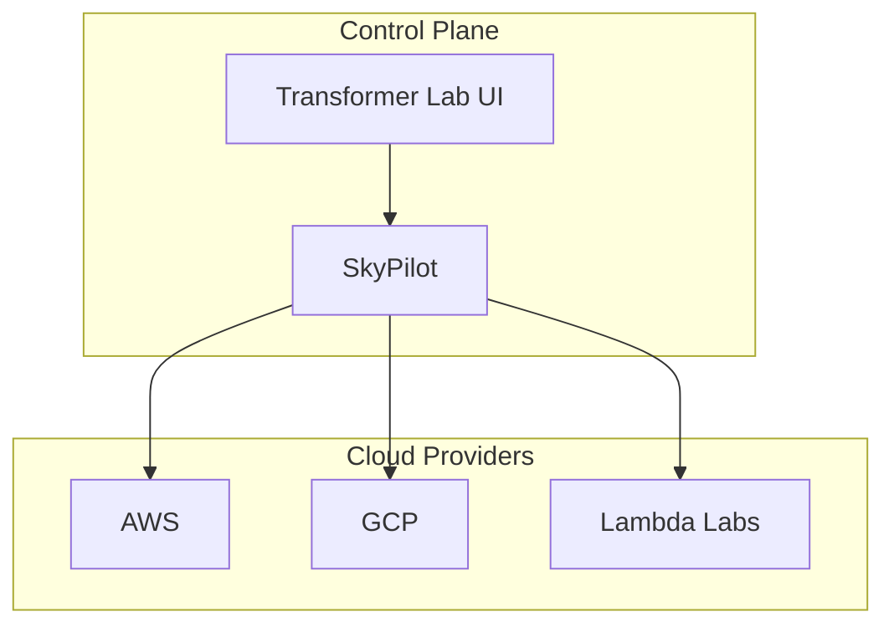

# Cloud Compute for ML

Many startups today do not operate local GPU clusters. Instead, they work with one or more cloud providers, negotiating reserved capacity and pricing directly. This chapter covers two common approaches: single-cloud and hybrid-cloud setups.

## Single Cloud Provider

If your team commits to a single cloud provider, the simplest path is to use that provider's managed ML platform—Google Vertex AI, AWS SageMaker, Azure ML, etc. These platforms handle job scheduling, GPU allocation, and storage integration out of the box.

Some major clouds also have managed Slurm if your team prefers it.

The tradeoff is vendor lock-in. Your workflows, storage, and tooling become tightly coupled to that provider. For many teams this is an acceptable tradeoff given the reduced operational complexity.

## Hybrid / Multi-Cloud

Some teams use multiple cloud providers to access better pricing, broader GPU availability, or to avoid dependence on a single vendor. The challenge is managing credentials, environments, and job routing across providers.

[SkyPilot](https://skypilot.readthedocs.io/) solves this. It provides a single interface for launching jobs across AWS, GCP, Azure, Lambda Labs, RunPod, and other providers. When you submit a job, SkyPilot checks real-time pricing and availability across your connected clouds and selects the best option that meets your hardware requirements.

You do not need to start with multiple clouds. You can configure SkyPilot with a single provider and add others later as needed.

### Architecture

The setup is straightforward: run SkyPilot on a lightweight VM or local machine. It acts as a control plane that provisions and manages GPU instances on your behalf.

Transformer Lab connects to SkyPilot to give researchers a single interface for launching jobs. They select the hardware they need; SkyPilot determines where to run it.

### Spot Instances

Cloud providers sell spare capacity as spot (or preemptible) instances at significant discounts. The risk is that these instances can be reclaimed with little notice.

SkyPilot's managed spot feature handles this automatically. You define a fallback strategy—for example, prefer AWS spot, fail over to GCP spot, fall back to Lambda Labs on-demand—and SkyPilot manages preemption recovery without manual intervention.

### Data Storage

Moving large datasets between clouds is slow and expensive. A few strategies to manage this:

- **Central object store:** Use a provider with low or zero egress fees (e.g., Cloudflare R2) as your primary data store.
- **Storage mounting:** SkyPilot can mount cloud storage buckets as local directories on remote instances, avoiding full dataset copies. Transformer Lab automatically stores aritifacts and models in an object store.
- **Regional caching:** If you frequently use one cloud region, replicate your datasets there to avoid repeated transfers.

### Other Considerations

- **Egress fees:** Transferring data out of a cloud provider's network incurs charges. Save checkpoints to storage within the same provider where the job runs, or use zero-egress providers.
- **High Speed Object Stores:** Specialized stores like AWS Onezone or JuiceFS can offer higher performance backed with the reliability of s3-like storage. 
- **Environment consistency:** Use Docker containers to ensure identical environments across providers.
